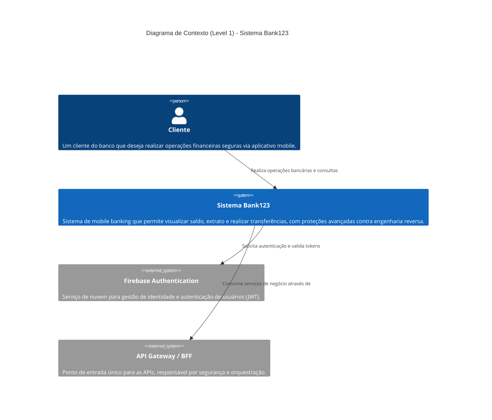
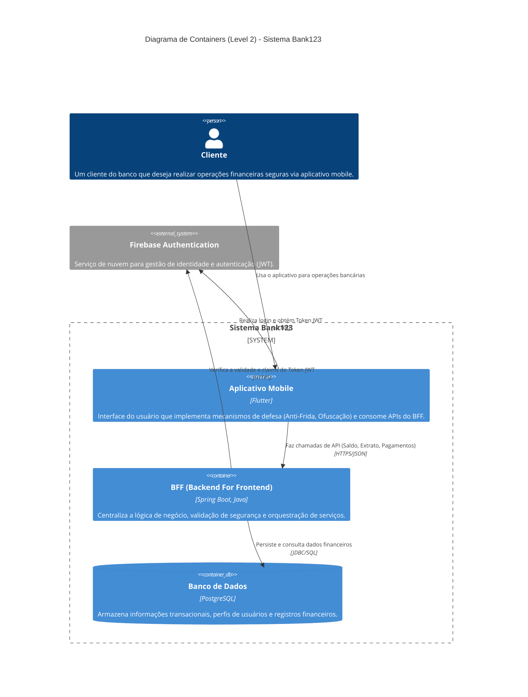
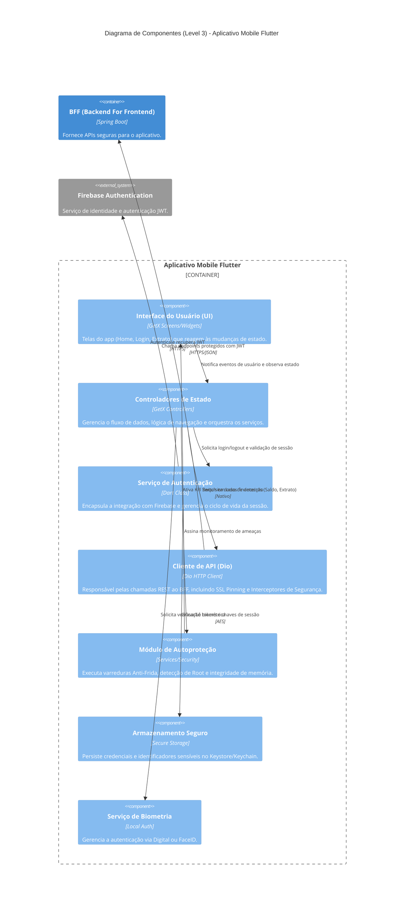
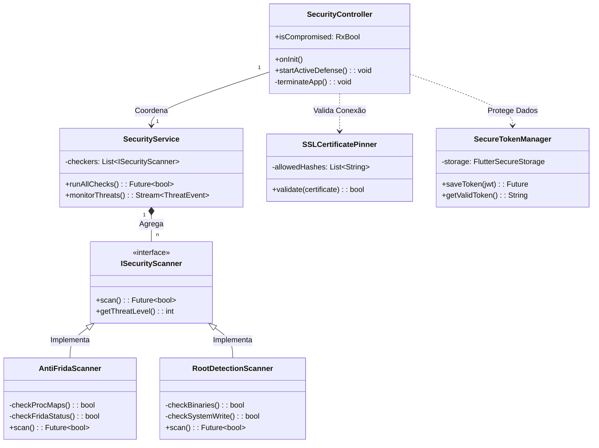

# 🏦 Bank123 - Mobile Frontend

Este é o frontend mobile do projeto **Bank123**, um protótipo desenvolvido como parte de um TCC focado em segurança cibernética em aplicações Flutter. O objetivo é demonstrar práticas seguras de autenticação, armazenamento de dados e integração com serviços de backend e nuvem.

---

## 📋 Requisitos Funcionais (RF)

Os requisitos funcionais descrevem as funcionalidades que o usuário pode realizar no aplicativo.

1.  **RF01 - Autenticação de Usuário:** O sistema deve permitir que o usuário realize login seguro utilizando e-mail e senha através do Firebase Authentication.
2.  **RF02 - Cadastro de Novo Usuário:** O sistema deve permitir a criação de novas contas, registrando o usuário no Firebase Authentication e integrando com o processo de análise de segurança.
3.  **RF03 - Fluxo de Segurança Pós-Cadastro:** Após o cadastro, o usuário deve ser desconectado e informado sobre um período de análise de até 5 minutos antes do primeiro acesso para mitigação de fraudes.
4.  **RF04 - Consulta de Saldo:** O usuário deve ser capaz de visualizar o saldo atualizado de sua conta bancária na tela inicial.
5.  **RF05 - Consulta de Extrato:** O sistema deve exibir a listagem detalhada de transações (entradas e saídas) do usuário, integrando com o BFF.
6.  **RF06 - Gestão de Perfil:** O usuário deve poder visualizar seus dados cadastrais e informações técnicas do Token JWT (e-mail, UID, claims personalizadas) para transparência de dados.
7.  **RF07 - Cópia de Token:** Funcionalidade para copiar o Token JWT completo para a área de transferência, facilitando auditorias e depuração técnica.
8.  **RF08 - Configurações de Segurança:** O usuário deve poder habilitar ou desabilitar o login por biometria de forma voluntária.
9.  **RF09 - Autenticação Biométrica:** Se habilitado nas configurações, o sistema deve permitir o login utilizando a biometria do dispositivo (Digital ou FaceID).
10. **RF10 - Transferência de Valores:** O sistema deve permitir a realização de transferências financeiras entre contas (funcionalidade em desenvolvimento/POC).
11. **RF11 - Gestão de Contatos:** O usuário deve poder visualizar uma lista de contatos para agilizar operações financeiras.

---

## 🔒 Requisitos Não Funcionais (RNF)

Os requisitos não funcionais descrevem os atributos de qualidade e restrições técnicas do sistema.

1.  **RNF01 - Segurança (Identidade):** Uso obrigatório do Firebase Authentication para gestão centralizada de identidade e emissão de tokens JWT.
2.  **RNF02 - Segurança (Persistência):** Dados sensíveis, como o número da conta e preferências de biometria, devem ser armazenados utilizando o `Flutter Secure Storage`, que utiliza Keychain (iOS) ou Keystore (Android).
3.  **RNF03 - Segurança (Comunicação):** Todas as requisições ao Backend (BFF) devem ser cifradas via HTTPS e incluir cabeçalhos de segurança: `Authorization (Bearer)`, `x-account-id` e `x-correlation-id`.
4.  **RNF04 - Segurança (Prevenção MITM):** Implementação de SSL Pinning através do cliente HTTP Dio para garantir a autenticidade do servidor e prevenir ataques Man-in-the-Middle.
5.  **RNF05 - Arquitetura (BFF):** Adoção do padrão Backend For Frontend (BFF) em Spring Boot para mediar a comunicação entre o app mobile e os serviços de backend.
6.  **RNF06 - Interface e UX:** A interface deve seguir as diretrizes do **Material Design 3**, utilizando um esquema de cores baseado em tons de vermelho e marrom para identidade visual.
7.  **RNF07 - Gerenciamento de Estado:** Uso da biblioteca `GetX` para gerenciamento de estado reativo, injeção de dependências e navegação.
8.  **RNF08 - Desempenho e Feedback:** O app deve exibir uma Splash Screen e indicadores de carregamento durante operações assíncronas para melhorar a percepção de performance.
9.  **RNF09 - Compatibilidade:** Suporte mínimo para Android API 18+.
10. **RNF10 - Monitoramento de Falhas:** O aplicativo deve utilizar o Firebase Crashlytics para monitorar estabilidade, capturar exceções fatais e registrar erros não tratados em tempo real.

---

## 🛡️ Mecanismos de Defesa Avançados

Além dos requisitos não funcionais padrão, este projeto implementa camadas extras de defesa focadas em **Anti-Reversing** e **Integridade de Runtime**, cruciais para o escopo de segurança do TCC.

### 1. Proteção Ativa Anti-Frida 🕵️‍♂️
O aplicativo possui um sistema de **autodefesa ativo** que monitora o ambiente de execução em busca do toolkit de instrumentação dinâmica **Frida**. A detecção ocorre em quatro vetores:
*   **Análise de Memória (`/proc/self/maps`):** O app lê sua própria memória mapeada para detectar bibliotecas injetadas (como `frida-agent.so`, `gum-js-loop`, `linjector`).
*   **Verificação de Portas:** Monitora tentativas de conexão na porta padrão do servidor Frida (`27042`).
*   **Varredura de Arquivos:** Busca por binários do `frida-server` em diretórios temporários e de sistema.
*   **Monitoramento Contínuo (Kill Switch):** Um *Timer* executa varreduras periódicas a cada 5 segundos. Se uma ameaça for detectada durante o uso, o aplicativo executa um `exit(0)` imediato, forçando o encerramento para prevenir a injeção de scripts.

### 2. Ofuscação de Código e Compilação 🧩
Para dificultar a engenharia reversa estática:
*   **Compilação AOT (Ahead-of-Time):** O código Dart é compilado para código de máquina nativo (ARM64/x86), eliminando a necessidade de interpretadores JIT em produção e removendo o código fonte original.
*   **R8 / ProGuard:** No Android, o código nativo e as classes Java/Kotlin passam por processos de *shrinking* e ofuscação de símbolos.
*   **Split Debug Info:** Em builds de release, recomenda-se o uso da flag `--obfuscate --split-debug-info` para remover metadados de depuração e renomear classes/funções para identificadores sem sentido (ex: `a.b()`), tornando a leitura do fluxo lógico extremamente complexa para atacantes.

---

## 🏛️ Arquitetura da Solução

O projeto adota uma arquitetura **Cloud Native**, focada em segurança e separação de responsabilidades.

### Diagrama C4 - Level 1 (Contexto)



### Diagrama C4 - Level 2 (Containers)

Este diagrama detalha os componentes internos do sistema Bank123 e como eles se comunicam.



### Diagrama C4 - Level 3 (Componentes: Aplicativo Mobile)

Este diagrama detalha a estrutura interna do aplicativo Flutter, destacando as camadas de lógica, segurança e integração.



### Diagrama C4 - Level 4 (Código: Camada de Segurança)

Este nível detalha a estrutura de classes e as interações que compõem a **Defesa Ativa** e a **Segurança de Runtime** do aplicativo. É o coração técnico do TCC.



### Diagrama de Integração Antigo


### Fluxo de Dados e Segurança
1.  **Auth (Firebase):** O usuário autentica e recebe um JWT assinado.
2.  **BFF (Spring Boot):** O App envia o JWT no header. O BFF valida o token e processa a lógica de negócio.
3.  **Banco de Dados (Postgres):** Armazena saldo, contas e livro caixa (transações).

---

## 🛠️ Tech Stack Mobile
* **Framework:** Flutter (Dart)
* **Gerência de Estado:** GetX
* **Http Client:** Dio (com Interceptors para Auth e Logging)
* **Segurança:** Firebase Auth, Flutter Secure Storage, Local Auth (Biometria)

---

## 🚀 Como Executar

### Pré-requisitos
* Flutter SDK (Stable)
* Emulador Android ou Dispositivo Físico
* Backend (BFF) em execução (opcional para algumas telas)

### Comandos Iniciais
```bash
# Instalar dependências
flutter pub get

# Configurar Firebase (necessário FlutterFire CLI)
flutterfire configure

# Rodar o projeto
flutter run
```

### Credenciais de Teste (Emulador)
* **PIN do Emulador:** 12345
* **E-mail:** `teste@teste.com.br`
* **Senha:** `teste123`

---

## 🔧 Configuração de Ambiente e Execução

Este projeto utiliza **variáveis em tempo de compilação** (`--dart-define`) para configurar endereços de API e outros segredos, garantindo maior segurança ao não empacotar arquivos `.env` texto-claro dentro do aplicativo.

### Opção 1: Via VS Code (Recomendado)

O projeto já inclui um arquivo de configuração de lançamento (`.vscode/launch.json`) pré-configurado. Basta acessar a aba **"Run and Debug"** do VS Code e selecionar a configuração:

*   **bank123**: Executa o app em modo debug conectando-se ao ambiente padrão.

O arquivo `launch.json` injeta automaticamente a variável `API_BASE_URL`.

### Opção 2: Via Linha de Comando (CLI)

Para rodar o projeto via terminal, é **obrigatório** passar a variável `API_BASE_URL`.

```bash
# Rodar em modo Debug
flutter run --dart-define=API_BASE_URL=https://bank123-main-297cd30.d2.zuplo.dev

# Rodar em modo Release
flutter run --release --dart-define=API_BASE_URL=https://bank123-main-297cd30.d2.zuplo.dev

# Gerar APK
flutter build apk --dart-define=API_BASE_URL=https://bank123-main-297cd30.d2.zuplo.dev
```

> **Nota de Segurança:** Não versionamos arquivos de configuração. As URLs e chaves devem ser injetadas pelo pipeline de CI/CD ou pelo desenvolvedor no momento do build.

---

## 🔐 Modos Duplos de Autenticação (Novo!)

O Bank123 suporta **três modos de autenticação** para atender diferentes cenários de desenvolvimento e teste:

### 🟢 Modo 1: Produção (Firebase) — **PADRÃO**

Usa autenticação real do Firebase. Recomendado para simulação de produção.

```bash
# Executar normalmente (sem --dart-define AUTH_MODE)
flutter run --dart-define=API_BASE_URL=https://bank123-main-297cd30.d2.zuplo.dev

# Ou com VS Code
# Selecione "bank123" em Run and Debug
```

**Características:**
- ✅ Firebase SDK inicializa normalmente
- ✅ Login com credenciais Firebase reais
- ✅ Tokens JWT assinados com chave privada Firebase
- ✅ Produção segura (zero mudanças de comportamento)

---

### 🟡 Modo 2: Desenvolvimento (Basic Auth via Mockoon) — **NOVO**

Testa o app **isolado de Firebase**, usando HTTP endpoints mock (ideal para CI/CD e E2E automatizado).

```bash
# Android Emulator
flutter run --dart-define=AUTH_MODE=basic \
  --dart-define=API_BASE_URL=http://10.0.2.2:8089

# iOS Simulator / Web
flutter run --dart-define=AUTH_MODE=basic \
  --dart-define=API_BASE_URL=http://localhost:8089

# Com auto-login (pré-preenche credenciais)
flutter run --dart-define=AUTH_MODE=basic \
  --dart-define=API_BASE_URL=http://10.0.2.2:8089 \
  --dart-define=AUTO_LOGIN=true
```

**Características:**
- ✅ Firebase SDK **não inicializa** (zero network)
- ✅ Login via HTTP (endpoints `/auth/login`, `/auth/refresh`, `/auth/logout`)
- ✅ Tokens JWT sem assinatura criptográfica (suficiente para testes)
- ✅ Auto-refresh de tokens expirados
- ✅ Totalmente offline se Mockoon estiver rodando localmente
- ✅ **Ideal para testes E2E, CI/CD, desenvolvimento isolado**

**Como rodar Mockoon:**
```bash
# Via CLI
npx mockoon-cli start --data bff-mockoon/bff-bank123.json

# Ou abra o arquivo bff-mockoon/bff-bank123.json no Mockoon Desktop
```

**Credenciais padrão:**
- Email: `teste@teste.com.br`
- Senha: `teste123`

Para mais detalhes, veja [bff-mockoon/README.md](bff-mockoon/README.md).

---

### 🔵 Modo 3: Testes Unitários (USE_MOCK=true)

Testa o app **completamente offline**, sem Firebase nem Mockoon.

```bash
flutter run --dart-define=USE_MOCK=true
```

**Características:**
- ✅ Nenhuma chamada de rede
- ✅ Firebase e BFF mockados em memória
- ✅ Ideal para testes unitários rápidos
- ⚠️ Não testa integração com servidor real

---

### Resumo: Qual modo usar?

| Cenário | Modo | Comando |
|---------|------|---------|
| Produção / Simulação real | Firebase (padrão) | `flutter run` |
| Testes E2E / CI/CD / Offline | Basic Auth | `flutter run --dart-define=AUTH_MODE=basic ...` |
| Testes unitários rápidos | Mock | `flutter run --dart-define=USE_MOCK=true` |

---

## 🛠️ Documentação Técnica Detalhada

Para mais detalhes sobre padrões de código, estrutura de diretórios e guias de contribuição, consulte:

👉 **[DEVELOPER.md](DEVELOPER.md)**

---

## 🎥 Demonstração

Assista ao vídeo de demonstração do funcionamento da aplicação, incluindo os fluxos de autenticação e segurança:

👉 **[Evidência de Funcionamento - YouTube](https://www.youtube.com/watch?v=b0IVpilbShs)**

---

*Este projeto é parte integrante de um Trabalho de Conclusão de Curso (TCC) sobre Segurança Cibernética.*
